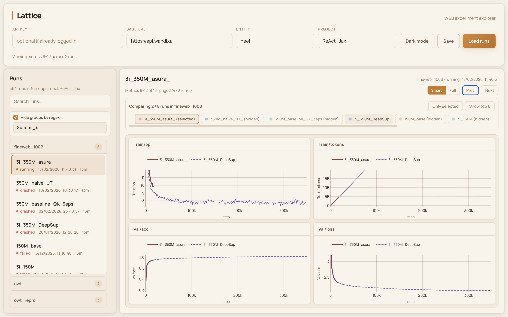
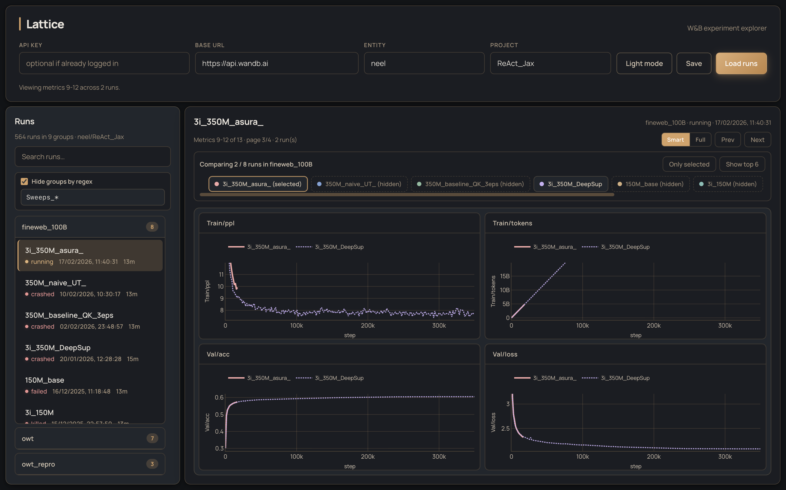

# Lattice

Lattice is an alternative, locally running open-source frontend for Weights & Biases (W&B).

It is intentionally minimal: load runs, browse groups, and plot metrics without using the hosted W&B UI.

## Run

```bash
uv sync
uv run python app.py
```

Open `http://127.0.0.1:8000`.

## Screenshots

Light mode


Dark mode

